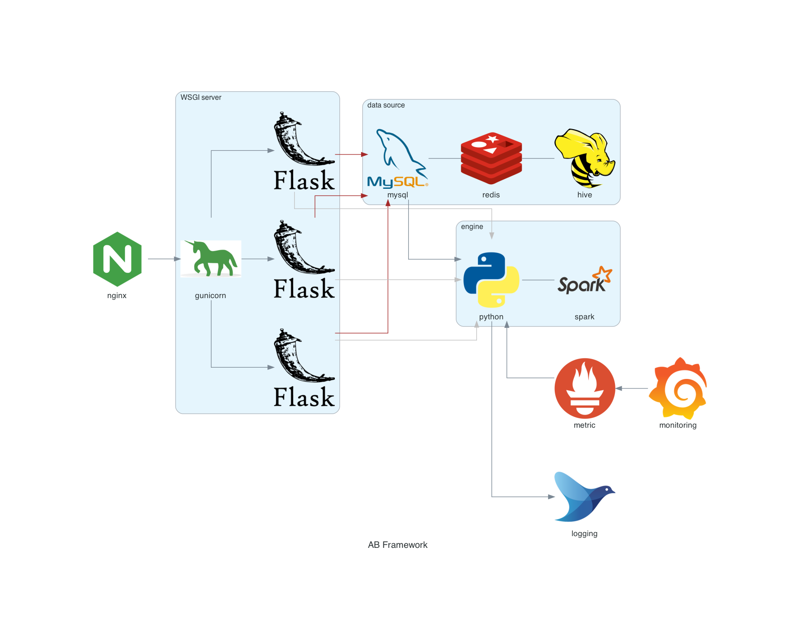

# Algorithm-Base框架: 让算法工程化更简单

随着机器学习火遍全球，越来越多的算法服务被开发出来。在算法服务化的过程中，如果你也遇到过如下问题，AB框架或许正是你要找的轮子：
- 算法工程师希望独立高效的开发出具有一定鲁棒性的服务
- 软件工程师在对众多算法工程化时，感觉到手脚不够用
- 算法工程师与软件工程师的工作边界难以划分
- 面对政企交付中的加密，许可证等特殊需求


## 功能与架构
AB框架以极简的方式，为算法提供了端到端的工程化能力，覆盖项目的创建，编译，部署，测试，文档等阶段。



## 快速上手

我们用一个极简的例子，为你的`算法`构建镜像并发布服务。

### 安装框架

- 当前框架只支持Linux和X86架构的MacOS
- 框架可以运行在python3.6+，建议使用miniconda

安装minioconda
```
wget https://repo.continuum.io/miniconda/Miniconda3-latest-Linux-x86_64.sh
sh Miniconda3-latest-Linux-x86_64.sh
```

创建虚拟环境
```
conda create -n ab python=3.7
source activate ab
```

框架的安装步骤，详见[安装](docs/cn/install.md)

### 编写hello world服务
git clone代码后，进入到`examples/simple`目录。这既是日后创建项目用的模板，也是我们的hello-world程序。  

你可以在simple项目的`algorithms`目录下实现你的算法，例子中提供了一个`demo.py`，其中实现了若干`算法`。如下代码，这段被`@algorithm`装饰器修饰的方法，是我们的加法算法。

```
# 会自动暴露为/api/algorithm/add接口
@algorithm()
def add(a: int, b: int) -> int:
    """
    一个简单的加法算法示例
    :param a: 第一个参数
    :param b: 第二个参数
    :return:
    """
    logger.info("enter algorithm {}, {} ".format(a, b))
    return a + b
```

### 安装hello world服务的依赖
在`examples/simple/setup/base.txt`中，存在几个必须要安装的依赖，才可以顺利运行hello world项目。  
第一行的ab框架可以跳过，因为在第一步中，你已经安装过ab框架了。


### 启动服务并测试
在`simple`根目录下，确保8000端口没有被占用，键入如下命令启动服务

```
pyab
```

服务成功启动后,看到类似如下输出，代表启动成功
```
[2023-02-01 13:07:33 +0800] [12257] [INFO] Starting gunicorn 20.0.4
[2023-02-01 13:07:33 +0800] [12257] [DEBUG] Arbiter booted
[2023-02-01 13:07:33 +0800] [12257] [INFO] Listening at: http://0.0.0.0:8000 (12257)
[2023-02-01 13:07:33 +0800] [12257] [INFO] Using worker: sync
[2023-02-01 13:07:33 +0800] [12267] [INFO] Booting worker with pid: 12267
[2023-02-01 13:07:33] [12267] [INFO] global log level set to DEBUG
[2023-02-01 13:07:33] [12267] [INFO] eureka not configured, ignore
[2023-02-01 13:07:33] [12267] [INFO] no config.KERBEROS found, kerberos uninitialized
[2023-02-01 13:07:33] [12267] [INFO] no config.SPARK found, spark uninitialized
[2023-02-01 13:07:33] [12267] [INFO] model path is: /tmp/xxxx
[2023-02-01 13:07:33 +0800] [12268] [INFO] Booting worker with pid: 12268
[2023-02-01 13:07:33] [12268] [INFO] global log level set to DEBUG
[2023-02-01 13:07:33] [12268] [INFO] eureka not configured, ignore
[2023-02-01 13:07:33] [12268] [INFO] no config.KERBEROS found, kerberos uninitialized
[2023-02-01 13:07:33] [12268] [INFO] no config.SPARK found, spark uninitialized
[2023-02-01 13:07:33] [12268] [INFO] model path is: /tmp/xxxx
[2023-02-01 13:07:33] [12267] [DEBUG] algorithms: {('add', 'python'): add(a: int, b: int) -> int,
 ('compress', 'python'): compress() -> int,
 ('crypto', 'python'): crypto(),
 ('sync_logs', 'python'): sync_logs(path)}
[2023-02-01 13:07:33] [12267] [DEBUG] fixtures: {}
[2023-02-01 13:07:33 +0800] [12257] [DEBUG] 2 workers
[2023-02-01 13:07:33] [12268] [DEBUG] algorithms: {('add', 'python'): add(a: int, b: int) -> int,
 ('compress', 'python'): compress() -> int,
 ('crypto', 'python'): crypto(),
 ('sync_logs', 'python'): sync_logs(path)}
[2023-02-01 13:07:33] [12268] [DEBUG] fixtures: {}
```

你可以通过如下命令访问前面定义的接口

```
curl --location --request POST 'localhost:8000/api/algorithm/add' \
--header 'Content-Type: application/json' \
--data-raw '{
	"args": {"a": 1, "b": 2}
}'
```

如下输出，返回了加法算法的结果
```
{"code":0,"data":{"sample_rate":null,"sample_count":null,"result":3}}
```

### 构建镜像，发布与访问

在`simple`项目根目录下键入如下命令，`abt命令行工具`会根据`.ab`中的配置，在你的本地一键构建应用镜像。
```
abt build
```

在`simple`项目根目录下键入如下命令，`abt命令行工具`会根据`.ab`中的配置，把你的应用一键部署到阿里云SAE应用。

```
abt deploy
```

deploy成功后，会在屏幕下方打印服务被绑定的slb地址和端口，形如
```
The SLB binding succeeded, Access path http://somehost:someport, 
```

直接通过以上链接访问 http://somehost:someport ， 看到`SUCCESS`即代表成功。

至此，你已经对AB框架有了初步印象。你可能会问，直接用flask封装接口，并启动服务，不是也可以达到同样效果么？AB框架并没有重复制造轮子，而是整合了各种轮子。
进一步使用框架前，需要对`docker`, `flask`, `gunicorn`有个初步了解，然后请移步`用户指南`，详细了解AB框架的特性。  


## 用户指南
- [安装](docs/cn/install.md)
- 服务能力
  - [服务与API](docs/cn/service.md)
  - [数据与API](docs/cn/service_data.md)
  - [同步与异步请求](docs/cn/task.md)
- 数据处理能力
  - [操作rds/hive/odps数据](docs/cn/dbm.md)
  - [spark处理数据](docs/cn/service.md)
  - [redis插件](docs/cn/redis.md)
- 安全能力
  - [加密python代码](docs/cn/encrypt.md)
  - [加密数据文件](docs/cn/crypto.md)
  - [API级调用限次插件](docs/cn/calllimit.md)
- 性能相关
  - [http压缩](docs/cn/compress.md)
  - [模型预热](docs/cn/warmup.md)
- 运维能力
  - [构建部署工具](docs/cn/abt.md)
  - [多环境配置](docs/cn/config.md)
  - [健康检查](docs/cn/health_check.md) 
  - [监控](docs/cn/monitoring.md)
  - [滚动日志](docs/cn/log.md)
  - [异常与错误处理](docs/cn/error.md)
  - [授权许可证](ext/license/README.md)
  - [测试用例](docs/cn/test.md)
  - [文档与路由表](docs/cn/doc.md)
  - [更多的功能](docs/cn/features.md)
- [插件机制](docs/cn/plugin.md)
- 最佳实践
  - [如何创建新项目](docs/cn/new-project.md)
  - [定制响应结构](docs/cn/custom-response-format.md)
  - [通过Jenkins构建镜像](docs/cn/jenkins.md)
  - [最佳实践](docs/cn/best-practice.md)  
  - [理解机器学习服务化中的gunicorn配置](https://zhuanlan.zhihu.com/p/371115835)
  - [gunicorn worker timeout问题排查](https://zhuanlan.zhihu.com/p/370330463)

## 贡献者
AB框架由陈轩，贺澎旭，王鹏飞开发并维护


