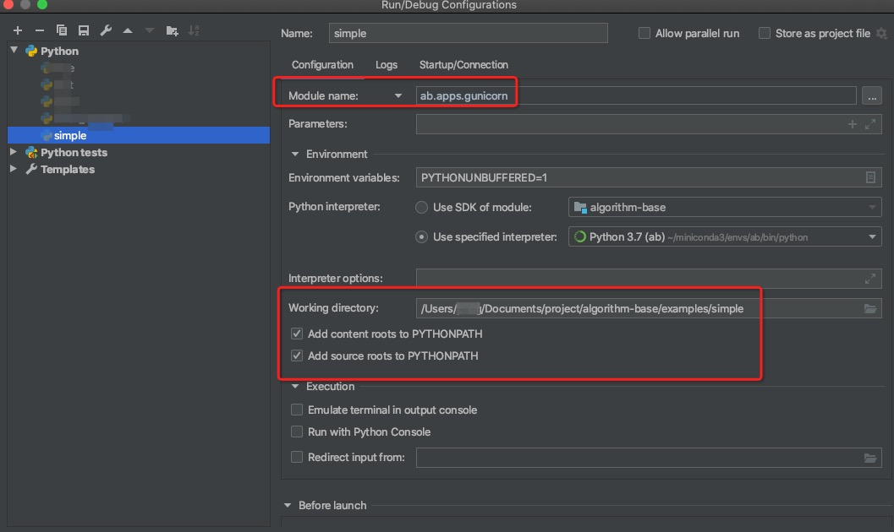

# 最佳实践

## 如何启动服务
在[使用ab框架的项目](./../../examples/simple)根目录下，执行以下命令便可以启动服务
```
pyab
```

## 如何断点调试ab服务



## 如何修改服务端口
- 在本机调试时，你本机的某些端口可能被占用，故支持修改config内的PORT变量(默认8000)，修改成任意端口进行调试。
- 在发布docker时，gunicorn`必须`使用8000端口，因为最终暴露服务的是docker内置的nginx，而不是gunicorn。
- 生产环境的真实路由情况是：user request -> nginx(80) -> gunicorn(8000)
- nginx的版本是1.14.2

```
docker run -p xxxx:80 your-image 
```


## 访问控制、密码等设计安全的问题
- 如果仅需本机访问，比如单机数据库等，则启动的时候绑定localhost即可，不绑定0.0.0.0，不对外提供服务，肯定没有安全风险。
- 如果需要对外提供访问，也分几种情况：
  - 仅需办公网络访问,需要设置ECS安全组.
  - 需要对公网提供访问，则不能使用弱密码，也不能开启debug模式，不要使用root权限直接执行。
  
```
       弱密码：不用写下来就能记住的密码全部都是弱密码。无论密码看起来多复杂，只要密码有规律，黑客就可以使用字典来撞库。
              redis这种内存数据库每秒钟可以被测试上百万次。你能想象`!qaz@wsx#edc`也是弱密码吗？
       debug模式：tomcat的debug端口、flask的debug模式允许用户连接上去debug，实际上是允许连接上的用户执行任意代码。
       root权限：如果服务以root权限执行，只要黑客攻破了服务，那么他就能获取root权限，在机器上做任何事情，包括抹除其攻击痕迹。我们可能根本不知道已经被攻击了。
       Jupyter Notebook被安全认为是高危服务，即使有密码也不能开放给公网访问，一定要加IP限制。

```


## 算法接口
- 算法接口最终会变成json格式返回给前端。如果字段各自有各自的含义，那么用dict；如果元素是等价的就用list。 比如:
```
    表示一个人: `{'name': 'fangliu', 'gender': 'male'}`，
    其中name和gender的value无法互换。
   
    表示一群人: `['fangliu', 'jiangwei', ....]`
    其中fangliu和jiangwei是等价的，位置可以互换。
```
   
- 如果接口以后可能扩展还要保证前向兼容性，那么尽量使用dict。比如：
```
    表示一群人: `[{'name': 'fangliu'}, {'name': 'jiangwei'}, ....]`
    看起来有些冗余，但如果要加一个gender字段的话就比较简单，而且就算前端不做改动也不会报错（因为name字段没变），前后端开发解耦：
    `[{'name': 'fangliu', 'gender': 'male'}, {'name': 'jiangwei', 'gender': 'male'}, ....]`
```

- 如果需要给算法增加新的参数，那么尽量给新参数增加默认值。比如：
```
    一开始算法入口函数这么写：`def main(data, name):`
    后来需要扩展增加一个gender字段，那么尽量加个默认值：`def main(data, name, gender='unknown'):`
    
    这样写的优点是:
    a. 保证前端接口的兼容性，不至于代码一更新，前端缺参数算法跑不起来了
    b. 前端可以不用和后端一起发布，可以分别开发然后更新，解耦
``` 

## 如何打包镜像
构建默认的docker镜像,在算法项目的根目录下执行

```
sh build.sh
```

默认使用python3.7版本，如果必须使用其他python版本，请修改DOCKERFILE中的基础镜像，如
FROM registry.cn-hangzhou.aliyuncs.com/medical-care/ab-base-36:latest


## 如何启动容器
- 实际项目中，需要自行添加内存，cpu限制
- 宿主机端口需要根据实际情况修改，容器内部端口固定为80

```
docker run -it -v $PWD/logs:/root/app/logs -p 8888:80 --restart=always your-image 
```

## 如何调试问题镜像
- 下面的命令，可以帮助你不启动gunicorn服务，直接进入容器

```
docker run -it --entrypoint bash <your-image> 
```

或

```
docker run -it your-image debug
```


## 测试三部曲
出了问题，先按照如下步骤排查问题

### 第一步：执行测试用例
- 安装并激活具有ab框架的虚拟环境 
- 比如，在控制台里运行pytest

```
pytest -e dev tests/test_demo.py
```

- 或者使用IDE测试(支持debug)


### 第二步：服务测试
- 先在控制台中，进入项目根目录pyab xxx（xxx为使用的配置环境)启动服务
- 使用curl等方式访问本机服务
curl调用例子

```
curl --location --request POST 'localhost:8000/api/algorithm/add' \
--header 'Content-Type: application/json' \
--data-raw '{
	"args": {"a": 1, "b": 2}
}'
```

Java调用例子

```
OkHttpClient client = new OkHttpClient().newBuilder()
  .build();
MediaType mediaType = MediaType.parse("application/json");
RequestBody body = RequestBody.create(mediaType, "{\n\t\"args\": {\"a\": 1, \"b\": 2}\n}");
Request request = new Request.Builder()
  .url("localhost:2333/api/algorithm/add")
  .method("POST", body)
  .addHeader("Content-Type", "application/json")
  .build();
Response response = client.newCall(request).execute();
```

### 第三步：使用容器测试
- 使用上方"启动容器"先启动容器
- 在容器外部通过`curl`等方式进行测试
